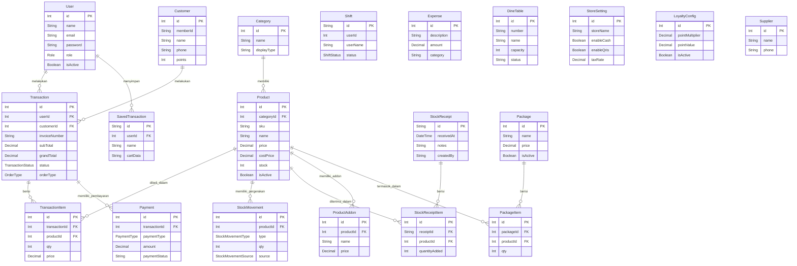

# Entity Relationship Diagram (ERD) Android POS

Berikut adalah Entity Relationship Diagram (ERD) dari sistem Android POS yang diambil berdasarkan struktur database pada file `schema.prisma`. Anda dapat menggunakan diagram ini untuk keperluan presentasi.

### Penjelasan Singkat Struktur
1. **Core / Transaksi**: Pusat dari sistem adalah entitas `Transaction` yang terhubung dengan `User` (kasir), `Customer` (pembeli), `TransactionItem` (barang yang dibeli), dan `Payment` (metode pembayaran).
2. **Katalog Produk**: Produk (`Product`) berada di dalam kategori (`Category`) dan memiliki ekstensi seperti `ProductAddon` atau digabung menjadi paket (`Package` & `PackageItem`).
3. **Manajemen Stok**: Pergerakan stok dilacak melalui `StockMovement` dan penerimaan stok baru tercatat di `StockReceipt` serta `StockReceiptItem`.
4. **Operasional & Setting**: Terdapat entitas pendukung operasional kasir seperti `Shift`, pencatatan pengeluaran di `Expense`, manajemen meja pada `DineTable`, dan pengaturan global toko seperti `StoreSetting` dan `LoyaltyConfig`.
